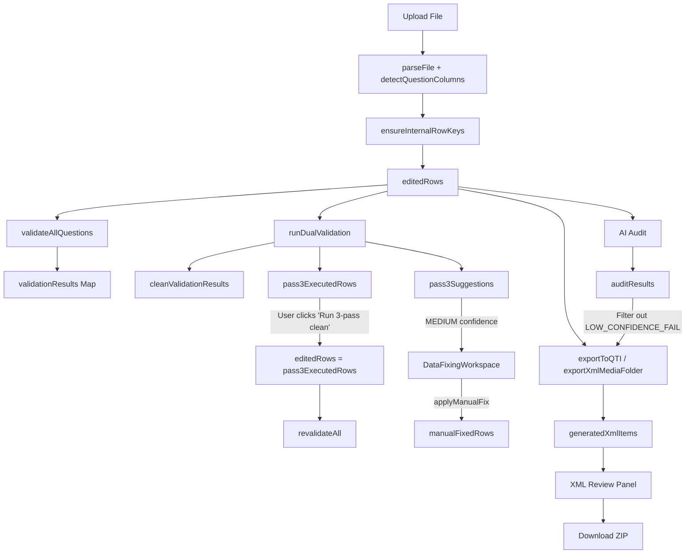

# BatchCreator.tsx — Complete Codebase Walkthrough

> **File**: [BatchCreator.tsx](file:///c:/Users/krish/Downloads/AssessmentCore/src/app/pages/workspace/BatchCreator.tsx)  
> **Total Lines**: ~7,400  
> **Location**: `src/app/pages/workspace/BatchCreator.tsx`

---

## 1. High-Level Purpose

`BatchCreator` is a **monolithic React component** that implements a multi-step wizard for converting spreadsheet-based question banks into QTI-compliant XML packages. It handles the entire lifecycle:

```
Upload → Validate → Auto-Clean → Manual Fix → AI Audit → Configure Export → Transform & Download
```

---

## 2. Wizard Steps (Lifecycle)

The wizard is controlled by a `currentStep` state variable of type `WizardStep`:

| Step         | Label      | What Happens                                                                                                                                           |
| ------------ | ---------- | ------------------------------------------------------------------------------------------------------------------------------------------------------ |
| `upload`     | Upload     | User uploads a spreadsheet (XLSX/CSV). File is parsed, columns are detected, and a preview is shown.                                                   |
| `validating` | Validation | All rows are validated against rules (duplicates, missing answers, answer-option mismatches, etc.). Results shown in a detailed report with filters.   |
| `clean-fix`  | Fixing     | 3-pass data cleaning pipeline runs. Auto-fixes are applied, then user enters the `DataFixingWorkspace` for manual fixes.                               |
| `ai-audit`   | AI Audit   | (Premium only) Each question is sent to an external AI audit endpoint for quality review. Results are shown inline with pass/fail/needs-review status. |
| `configure`  | Configure  | User selects QTI version, export mode, image handling, math format, and optional template XML.                                                         |
| `transform`  | Export     | XML is generated per-question, shown in a review panel, then packaged into a ZIP for download.                                                         |

### Step Navigation Logic

- **`stepOrder`** (L240-247): Dynamic array — excludes `ai-audit` if the toggle is off.
- **`canNavigateToStep(step)`** (L285-311): Guards that check file data presence, premium status, and whether prior steps are complete.
- **`handleStepperJump(step)`** (L313-326): The actual navigator. Shows a toast error for free users trying to access premium steps.
- **`isStepComplete(step)`** (L267-275): Returns boolean for each step's completion criteria.

---

## 3. State Variables — Grouped by Domain

### 3.1 File & Upload State

| Variable                 | Type               | Purpose                                                                 |
| ------------------------ | ------------------ | ----------------------------------------------------------------------- |
| `uploadedFiles`          | `File[]`           | The uploaded spreadsheet file(s)                                        |
| `fileData`               | `FileData \| null` | Parsed file: `{ fileName, columns, rows }`                              |
| `uploadPreviewColumns`   | `string[]`         | First 8 columns for the upload preview table                            |
| `uploadPreviewRows`      | `Record[]`         | First 6 rows for the upload preview                                     |
| `isParsingUploadPreview` | `boolean`          | Loading state for file parsing                                          |
| `columnMapping`          | `any`              | Auto-detected column mapping (questionCol, answerCol, optionCols, etc.) |
| `editedRows`             | `Record[]`         | **The master data array** — all downstream operations read/write this   |

### 3.2 Validation State

| Variable                                        | Type                                          | Purpose                                         |
| ----------------------------------------------- | --------------------------------------------- | ----------------------------------------------- |
| `validationResults`                             | `Map<string, ValidationResult>`               | Raw validation results keyed by row key         |
| `isValidating`                                  | `boolean`                                     | Loading state                                   |
| `validationProgress` / `validationProgressText` | `number` / `string`                           | Progress bar state                              |
| `showValidationReport`                          | `boolean`                                     | Whether to render the report UI                 |
| `validationSearch`                              | `string`                                      | Search filter text                              |
| `validationFilter`                              | `'all' \| 'valid' \| 'caution' \| 'rejected'` | Status filter                                   |
| `validationRuleFilter`                          | `string \| null`                              | Filter by specific issue code                   |
| `selectedValidationRowKey`                      | `string \| null`                              | Currently selected row in the validation list   |
| `viewMode`                                      | `'raw' \| 'clean'`                            | Toggle between raw and cleaned validation views |

### 3.3 Data Cleaning Pipeline State (3-Pass System)

| Variable                  | Type                                       | Purpose                                                |
| ------------------------- | ------------------------------------------ | ------------------------------------------------------ |
| `cleanValidationResults`  | `Record<string, ValidationResult> \| null` | Results after Pass 1+2 cleaning                        |
| `cleaningMetrics`         | `ImprovementMetrics \| null`               | Before/after stats from cleaning                       |
| `cleaningLogs`            | `CleanLog[]`                               | Detailed log of each field change in Pass 1+2          |
| `rowImprovements`         | `RowImprovementRecord[]`                   | Per-row improvement records                            |
| `pass3Suggestions`        | `RemediationSuggestion[]`                  | MEDIUM-confidence suggestions requiring user decision  |
| `pass3Metrics`            | `Pass3Metrics \| null`                     | Stats about Pass 3 suggestions                         |
| `pass3ExecutedRows`       | `any[]`                                    | Rows after Pass 3 HIGH-confidence auto-fixes applied   |
| `pass3ExecutionMetrics`   | `Pass3ExecutionMetrics \| null`            | Count of suggestions applied                           |
| `pass3ExecutionLogs`      | `Pass3ExecutionLog[]`                      | Detailed log of Pass 3 execution                       |
| `isApplyingAutoFixes`     | `boolean`                                  | Loading state for applying auto-fixes                  |
| `autoFixComparison`       | `object \| null`                           | Before/after summary for the auto-fix preview          |
| `hasProceededToManualFix` | `boolean`                                  | Whether user moved past auto-fix preview to manual fix |
| `cleaningPass`            | `number`                                   | 0-3, animated progress indicator during auto-fix       |

### 3.4 Manual Fix State (passed to `DataFixingWorkspace`)

| Variable                      | Type                                       | Purpose                                       |
| ----------------------------- | ------------------------------------------ | --------------------------------------------- |
| `manualFixedRows`             | `Map<string, any>`                         | Rows the user has manually edited             |
| `manualFixedRowsRef`          | `Ref<Map>`                                 | Synchronous ref for rapid edits               |
| `manualFixResults`            | `Map<string, ValidationResult>`            | Re-validation results for manually fixed rows |
| `manualFixHistory`            | `Map<string, {field, original}>`           | Undo history for manual fixes                 |
| `manualFixInputs`             | `Map<string, string>`                      | Current input values in the fix UI            |
| `manualMetrics`               | `{manualFixesApplied, rowsImprovedByUser}` | Counters                                      |
| `selectedCleanRowKey`         | `string \| null`                           | Currently selected row in fixing workspace    |
| `acceptedCleanSuggestionKeys` | `Set<string>`                              | Suggestions the user accepted                 |

### 3.5 AI Audit State

| Variable               | Type                            | Purpose                                |
| ---------------------- | ------------------------------- | -------------------------------------- |
| `isAuditing`           | `boolean`                       | Whether audit is in progress           |
| `auditResults`         | `Record<string, AuditResult>`   | AI audit results per row               |
| `auditProgress`        | `{current, total}`              | Progress tracker                       |
| `auditOverrides`       | `Set<string>`                   | Rows where user dismissed AI rejection |
| `aiAuditPageIndex`     | `number`                        | Pagination for audit list              |
| `aiAuditStatusFilter`  | `'ALL' \| 'FAILED' \| 'PASSED'` | Filter                                 |
| `aiAuditEditingRowKey` | `string \| null`                | Row being inline-edited                |
| `aiAuditDraftRows`     | `Map<string, Record>`           | Draft edits during inline edit         |
| `selectedAuditRowKey`  | `string \| null`                | Selected row in audit panel            |

### 3.6 AI Validation State (XML-level AI check)

| Variable               | Type                                       | Purpose                                                |
| ---------------------- | ------------------------------------------ | ------------------------------------------------------ |
| `aiValidationEnabled`  | `boolean`                                  | Whether to intercept export with AI validation         |
| `aiValidationPhase`    | `'idle' \| 'ready' \| 'running' \| 'done'` | Phase tracker                                          |
| `aiValidationResults`  | `AIValidationItem[]`                       | Results from AI validation                             |
| `aiValidationProgress` | `{current, total}`                         | Progress                                               |
| `aiProvider`           | `AIProvider`                               | Selected AI provider (gemini, etc.)                    |
| `pendingExportContext` | `object \| null`                           | Saved ZIP context so export can resume after AI review |
| `aiFixingItemNo`       | `number \| null`                           | Item currently being AI-fixed                          |

### 3.7 Export / Transform State

| Variable                                        | Type                            | Purpose                                                      |
| ----------------------------------------------- | ------------------------------- | ------------------------------------------------------------ |
| `outputFormat`                                  | `string`                        | QTI version: `'qti-1.2'`, `'qti-2.1'`, `'qti-3.0'`, `'json'` |
| `exportMode`                                    | `string`                        | `'qti-package'` or `'xml-media-folder'`                      |
| `isExporting`                                   | `boolean`                       | Loading state                                                |
| `transformDone`                                 | `boolean`                       | Whether export completed                                     |
| `generatedXmlItems`                             | `Array<{fileName, xmlContent}>` | Generated XML items for review                               |
| `isXmlReviewOpen`                               | `boolean`                       | Whether XML review panel is shown                            |
| `xmlReviewPageIndex` / `selectedXmlReviewIndex` | `number`                        | Pagination/selection in review                               |
| `xmlPreviewMode`                                | `'rendered' \| 'raw'`           | Toggle between rendered and raw XML view                     |
| `isRawXmlEditing`                               | `boolean`                       | Whether user is editing raw XML                              |
| `rawXmlDraft` / `rawXmlDraftSourceIndex`        | `string` / `number`             | Draft state for raw XML editing                              |

### 3.8 Media / Image State

| Variable                          | Type                          | Purpose                                 |
| --------------------------------- | ----------------------------- | --------------------------------------- |
| `mediaZipFile`                    | `File \| null`                | Uploaded media ZIP                      |
| `mediaFiles`                      | `Map<string, MediaFile>`      | Extracted media files (filename → data) |
| `mediaValidationErrors`           | `MediaValidationError[]`      | Errors from media reference validation  |
| `isProcessingMedia`               | `boolean`                     | Loading state                           |
| `uploadedMediaUrls`               | `UploadedMediaUrl[]`          | URLs after Supabase upload              |
| `isUploadingMediaUrls`            | `boolean`                     | Loading state                           |
| `containsImages` / `containsMath` | `string`                      | User toggle                             |
| `mathFormat`                      | `string`                      | `'mathjax'` or `'mathml'`               |
| `mathDetection`                   | `MathDetectionResult \| null` | Auto-detected math info                 |

### 3.9 Template XML State

| Variable                | Type                        | Purpose                     |
| ----------------------- | --------------------------- | --------------------------- |
| `hasTemplateXml`        | `string`                    | `'yes'` or `'no'`           |
| `templateXmlFile`       | `File \| null`              | Uploaded template           |
| `templateXmlContent`    | `string`                    | Content of template file    |
| `showTemplateMappingUI` | `boolean`                   | Whether mapping UI is shown |
| `templateMapping`       | `ColumnMapping \| null`     | User-defined mapping        |
| `extractedTemplate`     | `ExtractedTemplate \| null` | Parsed template structure   |

### 3.10 Metadata Columns State

| Variable                 | Type                                  | Purpose                        |
| ------------------------ | ------------------------------------- | ------------------------------ |
| `addedMetadataKeys`      | `string[]`                            | User-added metadata field keys |
| `metadataValues`         | `Map<string, Record<string, string>>` | Per-row metadata values        |
| `isMetadataDropdownOpen` | `boolean`                             | Dropdown state                 |

### 3.11 UI / Layout State

| Variable            | Type         | Purpose                 |
| ------------------- | ------------ | ----------------------- |
| `currentStep`       | `WizardStep` | Current wizard step     |
| `isSidebarHovered`  | `boolean`    | Sidebar expand/collapse |
| `isProfileMenuOpen` | `boolean`    | Profile dropdown        |
| `isDark`            | `boolean`    | Theme                   |
| `isPremium`         | `boolean`    | Premium access flag     |

### 3.12 Student Preview State (Transform step)

| Variable                    | Type                                                          | Purpose                                 |
| --------------------------- | ------------------------------------------------------------- | --------------------------------------- |
| `studentChoiceResponses`    | `Record<number, string[]>`                                    | Student's selected choices per question |
| `studentTextResponses`      | `Record<number, string>`                                      | Student's text answers                  |
| `studentOrderResponses`     | `Record<number, string[]>`                                    | Student's ordering answers              |
| `studentPreviewSubmissions` | `Record<number, {submitted, isCorrect, score, feedbackHtml}>` | Submission results                      |

---

## 4. Key Derived / Computed Values (useMemo)

| Name                                       | Lines   | What it computes                                                    |
| ------------------------------------------ | ------- | ------------------------------------------------------------------- |
| `stepOrder`                                | 240-247 | Wizard step array (with/without ai-audit)                           |
| `activeValidationMap`                      | 354-359 | Merges raw or clean validation results based on `viewMode`          |
| `validationRows`                           | 361-384 | Enriched row objects with stem, answer, type, and validation result |
| `validationRuleCounts`                     | 386-394 | Issue code → count mapping                                          |
| `filteredValidationRows`                   | 396-405 | Filtered by status, rule, and search query                          |
| `validationByType`                         | 407-436 | Question type distribution (MCQ, MSQ, T/F, etc.)                    |
| `aiAuditQueueRows`                         | 579-643 | Full audit queue with fix tags, AI status, and feedback             |
| `filteredAiAuditQueueRows`                 | 645-651 | Filtered by AI status filter                                        |
| `visibleAiAuditQueueRows`                  | 654-657 | Paginated slice                                                     |
| `detectedMetadataKeys`                     | 672-688 | Metadata keys already covered by column detection                   |
| `availableMetadataToAdd`                   | 691-695 | Metadata fields not yet added                                       |
| `previewTableColumns` / `previewTableRows` | 446-468 | Upload preview data                                                 |

---

## 5. Major Handler Functions

### 5.1 File Upload & Parsing

| Handler                       | Lines     | Purpose                                                                                                                |
| ----------------------------- | --------- | ---------------------------------------------------------------------------------------------------------------------- |
| `handleFileSelection(file)`   | 868-884   | Sets file, parses preview columns/rows                                                                                 |
| `handleFileUpload(event)`     | 887-892   | onChange handler for file input                                                                                        |
| `loadLatestOcrToStage()`      | 894-912   | Loads latest OCR extraction from Supabase                                                                              |
| `handleProceedToValidation()` | 1048-1155 | **Core**: Parses file → detects columns → validates all rows → runs dual-validation pipeline → sets all cleaning state |

### 5.2 Validation

| Handler                         | Lines     | Purpose                                                        |
| ------------------------------- | --------- | -------------------------------------------------------------- |
| `handleDataChange(updatedRows)` | 1251-1274 | Re-validates after inline edits                                |
| `revalidateAll()`               | 3256-3323 | Full re-validation (merges manual fixes, runs dual-validation) |
| `getValidationStats()`          | 3400-3428 | Computes valid/caution/rejected/duplicate counts               |
| `getReportData()`               | 3431-3454 | Merges manual fixes into results for reporting                 |
| `handleDeduplicate()`           | 1455-1531 | Groups duplicates by fingerprint, removes all but first        |

### 5.3 Auto-Fix Pipeline

| Handler                               | Lines     | Purpose                                                          |
| ------------------------------------- | --------- | ---------------------------------------------------------------- |
| `handleApplyAutomatedFixes()`         | 3325-3358 | Replaces `editedRows` with `pass3ExecutedRows` (auto-fixed data) |
| `handleReRunValidationAfterAutoFix()` | 3360-3374 | Re-validates after auto-fix to show before/after comparison      |

### 5.4 Manual Fix (delegated to DataFixingWorkspace)

| Handler                                     | Lines     | Purpose                                           |
| ------------------------------------------- | --------- | ------------------------------------------------- |
| `applyManualFix(rowKey, suggestion, value)` | 3416-3454 | Validates candidate row, applies if not regressed |
| `applyBulkManualEdits(rowKey, edits)`       | 3457-3482 | Applies multiple field edits in one shot          |
| `undoManualFix(rowKey)`                     | 3484-3496 | Reverts a manual fix                              |
| `getRowOptionsForSuggestion(rowIndex)`      | 3385-3397 | Gets option choices for dropdown in fix UI        |

### 5.5 AI Audit

| Handler                                              | Lines     | Purpose                                                      |
| ---------------------------------------------------- | --------- | ------------------------------------------------------------ |
| `handleStartAiAudit()`                               | 2403-2468 | Health check → collect visible rows → sequential audit calls |
| `handleAuditSingleQuestion(row, rowKey)`             | 2662-2691 | Audit a single question                                      |
| `handleStartInlineAuditEdit(rowKey, rowData)`        | 2693-2700 | Enter inline edit mode                                       |
| `handleInlineAuditFieldChange(rowKey, field, value)` | 2702-2709 | Update draft value                                           |
| `handleSaveInlineAuditEdit(rowKey)`                  | 2711-2737 | Save edit, clear audit result, update editedRows             |
| `handleDismissAuditRejection(rowKey)`                | 2739-2745 | Override an AI rejection                                     |
| `handleClearAuditResults()`                          | 2747-2751 | Reset all audit state                                        |

### 5.6 Export / Transform

| Handler                          | Lines     | Purpose                                                                          |
| -------------------------------- | --------- | -------------------------------------------------------------------------------- |
| `handleProceedToTransform()`     | 1188-1201 | Validates config, navigates to transform step                                    |
| `handleStartTransformBuild()`    | 1203-1221 | Routes to `exportToQTI()`, `exportXmlMediaFolder()`, or `exportToJSON()`         |
| `exportToQTI()`                  | 1642-2029 | **Core export**: Iterates rows → generates QTI XML → packages ZIP → opens review |
| `exportXmlMediaFolder()`         | 2060-2320 | Same but with `xml/` and `media/` folder structure                               |
| `exportToJSON()`                 | 2337-2386 | Simple JSON export                                                               |
| `downloadZipBlob(blob, count)`   | 2032-2057 | Downloads the ZIP blob, tracks export usage                                      |
| `handleDownloadReviewedXml()`    | 3182-3254 | Downloads the reviewed/edited XML items                                          |
| `handleDownloadCorrectedSheet()` | 2470-2660 | Generates a styled XLSX with corrected data                                      |

### 5.7 AI Validation (XML-level)

| Handler                                 | Lines     | Purpose                                             |
| --------------------------------------- | --------- | --------------------------------------------------- |
| `handleStartAIValidation()`             | 2799-2973 | Generates XML → runs AI validation → stores results |
| `handleAIItemXmlChange(itemNo, newXml)` | 2975-2981 | Update a single XML item                            |
| `handleAIAutoFix(itemNo)`               | 2983-3014 | AI-fix a single XML item                            |
| `handleAIRevalidate()`                  | 3017-3043 | Re-run AI validation on all items                   |
| `handleAIDownloadValid()`               | 3046-3136 | Download only AI-validated items                    |
| `handleAICancel()`                      | 3138-3144 | Reset AI validation state                           |

### 5.8 Validation Report Generation

| Handler                            | Lines      | Purpose                                                                                                                                              |
| ---------------------------------- | ---------- | ---------------------------------------------------------------------------------------------------------------------------------------------------- |
| `handleDownloadValidationReport()` | 3456-4074  | Generates a full HTML report with donut charts, KPIs, recovery metrics, issue cards, before/after samples, and opens it in a new window for printing |
| `handleDownloadRowLevelReport()`   | 4076-~4700 | Generates a row-by-row HTML report with every question's issues listed                                                                               |

### 5.9 Media Handling

| Handler                           | Lines     | Purpose                                      |
| --------------------------------- | --------- | -------------------------------------------- |
| `handleMediaUpload(event)`        | 1344-1375 | Extracts media from ZIP file                 |
| `handleMediaFolderUpload(event)`  | 944-999   | Handles folder upload (non-ZIP)              |
| `handleApplySupabaseUrls()`       | 1157-1186 | Uploads media to Supabase, maps URLs to rows |
| `applyManualUploadedUrlMapping()` | 1276-1341 | Manual column-based URL mapping              |

### 5.10 Metadata Management

| Handler                                              | Lines     | Purpose                                    |
| ---------------------------------------------------- | --------- | ------------------------------------------ |
| `handleAddMetadataField(fieldKey)`                   | 2754-2758 | Add a metadata column                      |
| `handleRemoveMetadataField(fieldKey)`                | 2760-2772 | Remove a metadata column + clean up values |
| `handleMetadataValueChange(rowKey, fieldKey, value)` | 2774-2781 | Update a single cell                       |
| `handleApplyMetadataToAll(fieldKey, value)`          | 2783-2797 | Bulk-fill empty cells with a value         |

---

## 6. The 3-Pass Cleaning Pipeline

This is the core data quality system, orchestrated via `runDualValidation()`:

### Pass 1 — Character Cleaning

- Zero-width characters
- Line breaks normalization
- Smart quotes → straight quotes
- Whitespace cleanup
- Null coercion

### Pass 2 — Structural Normalization

- Answer format standardization
- Option label alignment
- Type detection refinement

### Pass 3 — Remediation Suggestions

- Generates `RemediationSuggestion[]` with confidence levels:
  - **HIGH**: Auto-applied silently (answer format fixes, obvious corrections)
  - **MEDIUM**: Shown to user in `DataFixingWorkspace` for manual decision
  - **LOW**: Logged but not surfaced

The cleaned rows (`pass3ExecutedRows`) replace `editedRows` when the user clicks "Run 3-pass clean".

---

## 7. JSX Render Structure

The render is a massive conditional block (~2,500 lines) based on `currentStep`. Each step returns a completely different layout:

```
return (
  <div className="h-screen grid" style={{ gridTemplateColumns: `${sidebarWidth}px ...` }}>
    <aside> ... collapsible sidebar with step navigation ... </aside>
    <main>
      {currentStep === 'upload' && ( ... upload UI ... )}
      {currentStep === 'validating' && ( ... validation report ... )}
      {currentStep === 'clean-fix' && ( ... cleaning pipeline + DataFixingWorkspace ... )}
      {currentStep === 'ai-audit' && ( ... AI audit panel ... )}
      {currentStep === 'configure' && ( ... export config form ... )}
      {currentStep === 'transform' && ( ... XML review + download ... )}
    </main>
  </div>
)
```

### Sidebar (shared across all steps)

- Collapsible (72px → 256px on hover)
- Shows logo, file info, step navigation with numbered/icon indicators
- Profile menu with logout at bottom
- Premium badge indicators

### Clean-Fix Step Sub-States

The `clean-fix` step has its own internal state machine (`cleanStageMode`):

- `'ready'` → Show "Run 3-pass clean" button
- `'running'` → Show animated cleaning progress
- `'autofix-preview'` → Show before/after comparison table
- `'manual-fix'` → Render `DataFixingWorkspace` component

---

## 8. External Dependencies & Companion Files

| File                                                                                                                               | Purpose                                                                                                                   |
| ---------------------------------------------------------------------------------------------------------------------------------- | ------------------------------------------------------------------------------------------------------------------------- |
| [batchCreatorUtils.ts](file:///c:/Users/krish/Downloads/AssessmentCore/src/app/pages/workspace/batchCreatorUtils.ts)               | Utility functions: row key generation, stats building, HTML escaping, image key canonicalization, answer label conversion |
| [batchCreator.types.ts](file:///c:/Users/krish/Downloads/AssessmentCore/src/app/pages/workspace/batchCreator.types.ts)             | Type definitions: `FileData`, `WizardStep`, `MetadataFieldDef`, etc.                                                      |
| [templateApplier.ts](file:///c:/Users/krish/Downloads/AssessmentCore/src/app/pages/workspace/templateApplier.ts)                   | Template XML injection logic                                                                                              |
| [xmlPreviewParser.ts](file:///c:/Users/krish/Downloads/AssessmentCore/src/app/pages/workspace/xmlPreviewParser.ts)                 | Parses XML for rendered preview                                                                                           |
| [exportLogic.ts](file:///c:/Users/krish/Downloads/AssessmentCore/src/app/pages/workspace/exportLogic.ts)                           | QTI manifest generation, export config validation                                                                         |
| [downloadValidationReport.ts](file:///c:/Users/krish/Downloads/AssessmentCore/src/app/pages/workspace/downloadValidationReport.ts) | Validation report download logic                                                                                          |
| [downloadCorrectedSheet.ts](file:///c:/Users/krish/Downloads/AssessmentCore/src/app/pages/workspace/downloadCorrectedSheet.ts)     | Corrected XLSX generation                                                                                                 |
| [DataFixingWorkspace.tsx](file:///c:/Users/krish/Downloads/AssessmentCore/src/app/components/DataFixingWorkspace.tsx)              | Manual fix UI component (sidebar + detail pane + editor grid)                                                             |

---

## 9. Known Issues & Duplication

> [!WARNING] > **Dead / Duplicated Code**
>
> The `exportToQTI()` function (L1642-2029) contains **three identical copies** of the `order` question type handler (L1799-1910). The block at L1835-1870 and L1871-1909 are exact duplicates of L1799-1834.

> [!WARNING] > **Report HTML Inline**
>
> `handleDownloadValidationReport()` (L3456-4074) and `handleDownloadRowLevelReport()` (L4076-~4700) contain **~1,200 lines of inline HTML/CSS** for report generation. This is a massive chunk that should be extracted to a separate module.

> [!IMPORTANT] > **`generateQTIManifest` Duplicated**
>
> The function at L1533-1640 is an exact copy of the one in [exportLogic.ts](file:///c:/Users/krish/Downloads/AssessmentCore/src/app/pages/workspace/exportLogic.ts). The extracted version exists but is not used.

> [!NOTE] > **State Explosion**
>
> The component has **80+ `useState` calls** and **15+ `useEffect` hooks**. Many state groups (AI audit, AI validation, manual fix, media, metadata) are independent domains that could be extracted into custom hooks.

---

## 10. Refactoring Opportunities

### Priority 1: Extract Custom Hooks

```
useFileUpload()          → uploadedFiles, fileData, uploadPreview*, handleFileUpload, handleFileSelection
useValidation()          → validationResults, isValidating, progress, handleProceedToValidation, revalidateAll
useCleaningPipeline()    → cleanValidation*, pass3*, autoFix*, handleApplyAutomatedFixes
useManualFix()           → manualFixed*, manualFixInputs, applyManualFix, undoManualFix
useAiAudit()             → auditResults, auditProgress, handleStartAiAudit, handleAuditSingle
useAiValidation()        → aiValidation*, handleStartAIValidation, handleAIAutoFix
useExport()              → outputFormat, exportMode, exportToQTI, exportXmlMediaFolder, exportToJSON
useMedia()               → mediaFiles, mediaZipFile, uploadedMediaUrls, handleMediaUpload
useMetadata()            → addedMetadataKeys, metadataValues, handleAddMetadataField
useTemplateXml()         → templateXmlFile, templateMapping, extractedTemplate
```

### Priority 2: Extract Report Generation

Move `handleDownloadValidationReport()` and `handleDownloadRowLevelReport()` to `downloadValidationReport.ts` (which already partially exists).

### Priority 3: Remove Dead Code

- Delete duplicate `order` question type blocks in `exportToQTI()` (L1835-1909)
- Delete inline `generateQTIManifest()` and use the one from `exportLogic.ts`
- Remove the inline `validateBeforeExport()`, `isExportConfigComplete()`, `validateExportConfig()` and use the versions from `exportLogic.ts`

### Priority 4: Split Render

Each wizard step's JSX should be its own component:

```
<UploadStep />
<ValidationStep />
<CleanFixStep />
<AiAuditStep />
<ConfigureStep />
<TransformStep />
```

### Priority 5: Consolidate Export Functions

`exportToQTI()` and `exportXmlMediaFolder()` share ~80% of their code. Extract a shared `generateXmlForRow()` function and a `buildExportZip()` orchestrator.

---

## 11. Data Flow Diagram



---

## 12. Quick Reference: Where Things Live

| What you're looking for      | Line Range |
| ---------------------------- | ---------- |
| Imports                      | 1-102      |
| All `useState` declarations  | 109-577    |
| Wizard step navigation logic | 240-340    |
| Computed/memoized values     | 341-710    |
| Effects (useEffect)          | 479-832    |
| File upload handlers         | 868-999    |
| Validation config & handler  | 1001-1155  |
| Media upload handlers        | 1157-1375  |
| Deduplication                | 1455-1531  |
| QTI Manifest (inline copy)   | 1533-1640  |
| `exportToQTI()`              | 1642-2029  |
| `exportXmlMediaFolder()`     | 2060-2320  |
| `exportToJSON()`             | 2337-2386  |
| AI Audit handlers            | 2390-2797  |
| AI Validation handlers       | 2799-3180  |
| XML review handlers          | 3146-3254  |
| Revalidation & auto-fix      | 3256-3374  |
| Manual fix handlers          | 3376-3454  |
| Validation report HTML       | 3456-4074  |
| Row-level report HTML        | 4076-~4700 |
| JSX render starts            | ~4700      |
| Upload step JSX              | ~4720-5020 |
| Validation step JSX          | ~5020-5543 |
| Clean-fix step JSX           | 5545-5970  |
| AI Audit step JSX            | ~5970-6400 |
| Configure step JSX           | ~6400-6900 |
| Transform step JSX           | ~6900-7422 |
